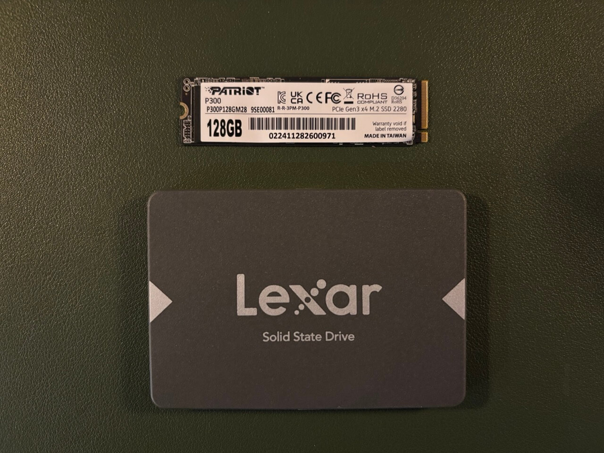

# Storage

## Types of Disks

### HDDs (Hard Disk Drives)

HDDs are comprised of read/write heads attached to an actuator arm and spinning hard discs, sort of like a record player. These drives are the best bang for your buck when it comes to capacity. Currently, they're about $20/TB new. However, they're also big, loud, and slow. And because they have moving parts, they're more prone to mechanical failure.

They're best suited for tasks like transferring large files since those are read/written **sequentially** in continuous blocks. Hard drives are pretty bad at tasks that are mostly random reads/writes (like launching applications) where data is read/written from scattered locations all over the disk. This is because the disk head has to physically move around a lot more which increases latency. It also increases wear and tear on the drive.

### SSDs (Solid State Drives)

SSDs have no moving parts and rely instead on flash memory. This makes them better than HDDs in pretty much every category except capacity. They range from $50 to $75 per TB new depending on a variety of factors. However they're way smaller, quiet, and tend to last longer than mechanical drives due to their lack of moving parts.

They excel at random reads/writes which makes them way more suitable for things like databases, operating systems, and launching applications. To be clear, they are better than HDDs in every possible way. If you had infinite money, you could just use SSDs for everything. But storage is pretty much always going to be the most expensive part of a home server build and HDDs are still a great solution for many use cases.

SSDs come in two main varieties according to the interface by which they are connected to the computer: Non-Volaitle Memory Express drives (NVMe) and Serial Advanced Tecnology Attachment drives (SATA). NVMe SSDs connect directly to the CPU via the PCIE bus which makes them extremely fast. SATA drives connect through the chipset resulting in significantly lower bandwidth and higher latency. The SATA interface is also how most HDDs communicate with the computer.

### SSD Speeds

| Interface | Speed                               |
| --------- | ----------------------------------- |
| SATA 3.0  | 6 Gigabits/s (600MB/s)              |
| PCIe 3.0  | 8 Gigatransfers/s per lane (1GB/s)  |
| PCIe 4.0  | 16 Gigatransfers/s per lane (2GB/s) |
| PCIe 5.0  | 32 Gigatransfers/s per lane (4GB/s) |

### SSD Form Factors



SSDs come in two main form factors: **M.2** and **2.5-inch** drives. In most cases, the smaller M.2 drives will be NVMe drives although SATA versions do exist. Conversely, most 2.5" drives you come across will be SATA drives.

---

## Storage Devices and Linux

### Disks and Block Devices

A **disk** is a physical storage device, such as an HDD or SSD. In Linux, disks are represented as block devices, meaning they handle data in fixed-size blocks rather than a stream of bytes. You can think of your disk as a physical entity, while a block device is how the Linux kernel interacts with it.

Block devices allow random access to data, making them suitable for file systems. Block devices are typically named `/dev/sdX` for SATA/SCSI drives (e.g., `/dev/sda`, `/dev/sdb`) and `/dev/nvmeXnY` for NVMe drives (e.g., `/dev/nvme0n1`).

### Partitions

A partition is a logically defined section of a disk. A single disk can be split into multiple partitions, each functioning as an independent unit. Partitioning allows for multiple operating systems, different file systems, or separate storage uses on the same physical disk. Partitions are represented as numbered block devices, e.g., `/dev/sda1`, `/dev/sda2` for SATA disks or `/dev/nvme0n1p1` for NVMe drives.

**Partition Tables**
To manage partitions, a disk has a partition table that records partition boundaries. The main type is GPT (GUID Partition Table). It supports up to 128 partitions (on most OSes), has no practical size limit, and is required for UEFI booting.

#### How Partitions Relate to Disks and Block Devices

Partitions are subdivisions of a block device. The full disk (e.g., `/dev/sda`) is a block device, and its partitions (e.g., `/dev/sda1`, `/dev/sda2`) are also block devices but only represent part of the disk.

### File Systems

A file system is a method for organizing and storing files on a partition. A file system determines how data is stored, accessed, and managed. Before using a partition, it must be formatted with a file system, such as:

- ext4 – Common on Linux.
- XFS – Good for large files, often used in enterprise storage.
- Btrfs – Copy-on-write, snapshots, used by some Linux distributions.
- ZFS – Advanced features, used in NAS and high-reliability systems.
- FAT32, exFAT, NTFS – Windows-compatible file systems.

To create a file system on a partition:

```bash
mkfs.ext4 /dev/sda1  # Formats partition sda1 with ext4
```

#### How File Systems Relate to Partitions and Block Devices

A file system sits on top of a partition, defining how data is stored. A partition may have a single file system, but some advanced file systems (like ZFS and LVM) span multiple disks. The file system makes the partition usable for storing files.

### Mounting

Linux does not use drive letters like Windows. Instead, a file system is mounted at a directory (mount point). The `/etc/fstab` file defines automatic mounts at boot. Example mount command:

```sh
mount /dev/sda1 /mnt/data
```

This makes the partition accessible at `/mnt/data`.

#### How Mounting Relates to File Systems and Partitions

A partition contains a file system, and mounting makes it available to users and applications.

## Review

- Disks are physical devices.
- Block devices represent disks and partitions in Linux.
- Partitions divide a disk into separate sections.
- File systems organize data within a partition.
- Mounting makes a file system accessible at a directory.
